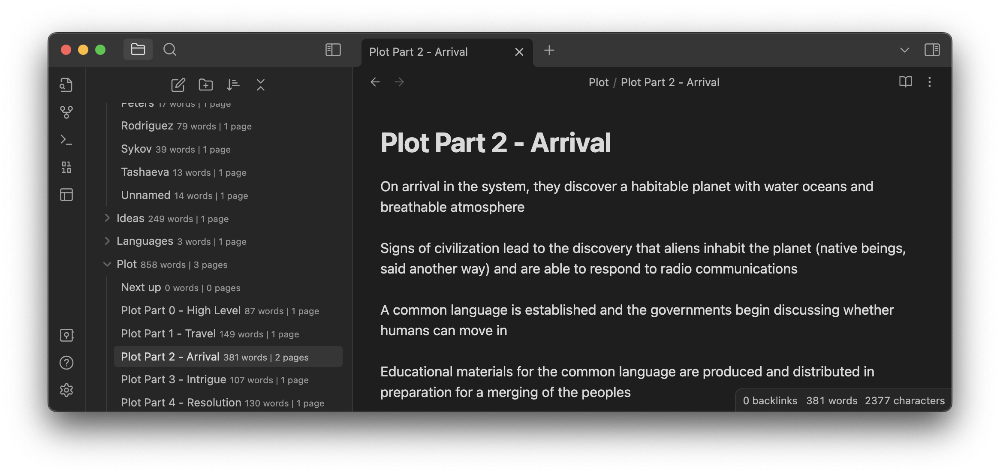

## Novel word count plugin



This plugin displays statistics of your choice next to every file, folder, and vault in the File Explorer pane. It updates in real time as you write.

### Settings

**Data to show.** Choose from the following:

- **Word count:** Total words. By default, a "word" is any sequence of non-whitespace characters. To change this, see Advanced > Word Count Method.
- **Page count:** Total pages, rounded up. By default, a page is 300 words. To change this, see Advanced > Page Count Method.
- **Page count (decimal):** Total pages, precise to 2 decimal points. Any settings that would apply to Page Count also apply to Page Count (decimal).
- **Character count:** Total characters (letters, symbols, numbers, and spaces).
- **Note count:** Total notes. Many people prefer to show this information on folders only; to do so, untoggle "Show same data on folders" and configure it as a data type there.
- **Link count:** Total *outbound* [links](https://help.obsidian.md/Getting+started/Link+notes).
- **Embed count:** Total [embedded](https://help.obsidian.md/Linking+notes+and+files/Embedding+files) images, files, and notes.
- **First alias:** The first [alias](https://help.obsidian.md/Linking+notes+and+files/Aliases) of each note. If a note has no alias, nothing is shown. Since folders don't have aliases, they also show nothing.
- **Created date:** The date the note was created. On a folder, this shows the earliest creation date of all notes in the folder.
- **Last updated date:** The date the note was last updated. On a folder, this shows the latest edit date of all notes in the folder.
- **File size:** Total size on your hard drive.

You can choose up to three data types to display side by side.

**Abbreviate descriptions.** Enable to show shortened counts:

| Full description | Abbreviated |
| ---------------- | ----------- |
| 3,250 words | 3,250w |
| 30 pages | 30p |
| 23,800 characters | 23,800ch |
| 12 notes | 12n |
| 3 links | 3x |
| 5 embeds | 5em |
| alias: july +3 | july |
| Created 1/22/2022 | 1/22/2022/c |
| Updated 1/22/2022 | 1/22/2022/u |
| 13.39 KB | 13.39kb |

**Alignment.** Choose where data is displayed relative to file/folder names: Inline, Right-aligned, or Below. All alignments work well with vanilla Obsidian, but Inline has the greatest compatibility with custom themes and plugins.

**Show same data on folders.** By default, the same data types are shown on notes and folders. You can toggle this setting off to choose different data types to show on folders only.

**Word count method.** Choose whether to count words using a space-delimited strategy (for English and other European languages) or by Han, Kana, and Hangul characters (for Chinese, Japanese, and Korean). The Auto-detect setting will count each file both ways, then return the larger result.

**Page count method.** Choose whether pages are counted by number of words (default: 300) or number of characters (default: 1500). You can change the number of words/characters used.

**Words per page/Characters per page.** Sets the number of words or characters per page, depending on the selected _Page count method._

**Reanalyze all documents.** Triggers a recount of all documents in the vault. Useful if you've made changes outside of Obsidian. (A hotkey binding is available for this command.)

**Debug mode.** Enables debugging output to the developer console, which may be useful if you need to report an issue.

### Excluding notes

To exclude a note from all counts _except_ note count, created date, last updated date, and file size, add the `exclude-from-word-count` [tag](https://help.obsidian.md/Editing+and+formatting/Tags) to the [properties](https://help.obsidian.md/Editing+and+formatting/Properties).

```md
---

tags: exclude-from-word-count

---
```

(The plugin will recognize the tag in any case and with or without hyphens/underscores, so you can follow your preferred tagging syntax, e.g. `ExcludeFromWordCount`, `Exclude_from_word_count`, and so on.)

Alternately, you can set the `wordcount` property to `false`. This property must always be lowercase and may not contain hyphens or underscores.

```md
---

wordcount: false

---
```

### Safety

Novel Word Count is fully compatible with Obsidian 1.0.

This plugin treats your vault as read-only. It never modifies, deletes, or renames any file or folder. It uses cached reads of all files for better performance.

Obsidian's API does not provide contractual access to the File Explorer pane, so this plugin uses duck typing to find it. This is technically undocumented, so there is a possibility that major updates of Obsidian will temporarily cause errors. If and when that happens, this plugin is designed to fail gracefully. In this unlikely scenario you may wish to disable the plugin until it can be updated.

This plugin's effect on the File Explorer DOM is extremely minimal, consisting of a custom HTML attribute and a few CSS rules. Style modifications are only active when the plugin is turned on.

Novel Word Count does not transmit any data over the Internet. All data is stored locally.

### Development

- Clone this repo.
- `npm i` or `yarn` to install dependencies
- `npm run dev` to start compilation in watch mode.
- `npm run dev-style` to start stylesheet compilation in watch mode.

### Creating a new release

- Run `npm run build` to make sure main.js and styles.css are up to date.
- Commit changes.
- Run `npm version {major|minor|patch}` to update the manifest and package.json.
- Push commits to the remote.
- Create a new release and tag in GitHub, both named after the version number e.g. `2.4.1` without a "v". Attach the files main.js, styles.css, and manifest.json.

### Installing the plugin automatically

Search "novel word count" in the community plugin browser, or use [this link](https://obsidian.md/plugins?id=novel-word-count).

### Installing the plugin manually

Visit the [Releases page](https://github.com/isaaclyman/novel-word-count-obsidian/releases). Download `main.js`, `styles.css`, and `manifest.json` to your vault at `VaultFolder/.obsidian/plugins/novel-word-count/`.